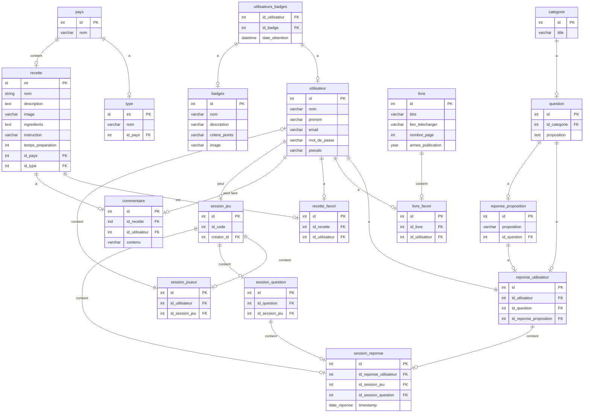

```mermaid
erDiagram
ut[utilisateur]{
int id PK
varchar nom
varchar prenom
varchar email
varchar mot_de_passe
varchar pseudo
}
ut||--||ru: a
ut||--o|lf: a
ut||--o|rf: a
bg[badges]{
int id PK
varchar nom
varchar description
varchar critere_points
varchar image
}
ut_bg[utilisateurs_badges]{
int id_utilisateur FK
int id_badge FK
datetime date_obtention
}
ut_bg||--o|ut: a
ut_bg||--o|bg: a
p[pays] {
int id PK
varchar nom
}
p||--o|t: a
t[type] {
id int PK
varchar nom
int id_pays FK
}
r[recette] {
id int PK
string nom
text description
varchar image
text ingredients
varchar instruction
int temps_preparation
int id_pays FK
int id_type FK
}
p ||--o| r : "contient"

rf[recette_favori]{
int id PK
int id_recette FK
int id_utilisateur FK
}
r||--o| rf : "est"
c[commentaire]{
int id PK
ind id_recette FK
int id_utilisateur FK
varchar contenu
}
r ||--o|c  : "a"
ut ||--o|c  : "peut faire"

l[livre]{
int id PK
varchar titre
varchar lien_telecharger
int nombre_page
year annee_publication
}
lf[livre_favori]{
int id PK
int id_livre FK
int id_utilisateur FK
}

l||--o| lf : "contient"
ca[categorie]{
int id PK
varchar title
}
ca ||--o| q :"a"

q[question]{
int id PK
int id_categorie FK
text proposition

}

q||--o|ru: a

rp[reponse_proposition]{
int id PK
varchar proposition
int id_question FK
}
q||--o|rp: a
ru[reponse_utilisateur]{
int id PK
int id_utlisateur FK
int id_question FK
int id_reponse_proposition FK
}
rp||--o|ru: a

sj[session_jeu]{
int id PK
int id_code
int creator_id FK
}
ut||--o|sj: peut

sjo[session_joueur]{
int id PK
int id_utilisateur FK
int id_session_jeu FK
}
sjo||--o|ut: contient
sj||--o|sjo: contient

sq[session_question]{
int id PK
int id_question FK
int id_session_jeu FK
}
sj||--o|sq: contient

sr[session_reponse]{
int id PK
int id_reponse_utilisateur FK
int id_session_jeu FK
int id_session_question FK
date_reponse timestamp
}
sq||--o|sr: contient
ru||--o|sr: contient
sj||--o|sr: contient
```
